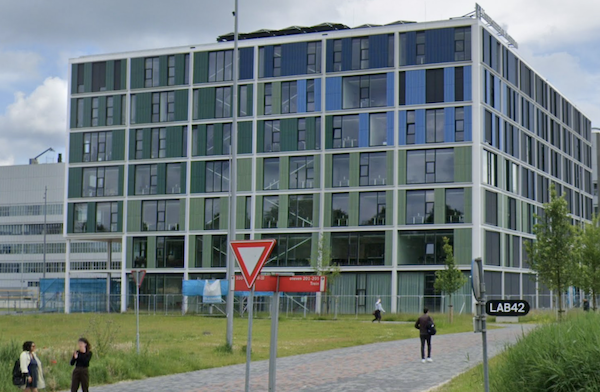

# Welkom bij de Minor Programmeren!

*Versie: lente 2026. Dit is de informatie voor studenten die de hele minor in één semester willen volgen.*

De komende maanden gaan we hard aan de slag om jou te leren zelfstandig programmeerproblemen op te lossen, kleine visualisaties te maken, en tools voor je eigen onderzoek te bouwen. Je gaat ook kennis maken met een heleboel bestaande tools, technieken, talen en theorieën die je nodig hebt om succesvol (mee) te werken aan grotere programma's.

Na deze minor heb je een heleboel kennis opgebouwd waarmee je zelfstandig kunt verder leren, bijvoorbeeld met een online cursus machine learning, een schakelprogramma voor een master, vakken uit de bachelor informatica, of technische trainingen om computationele technieken toe te passen in je eigen vakgebied.

In dit document vind je praktische informatie over de minor en over regels die wij belangrijk vinden. Let op: het gaat er bij ons nogal anders aan toe dan bij andere opleidingen.

<iframe style="width:100%; height: 280px;" src="https://player.vimeo.com/video/130987431?color=ff9933&title=0&byline=0&portrait=0" frameborder="0" webkitallowfullscreen mozallowfullscreen allowfullscreen></iframe>
<a href="http://www.bloomberg.com/graphics/2015-paul-ford-what-is-code/">
Bron: <em>What is code?</em> van Paul Ford. Lees dat essay!</a>

Je hebt er voor gekozen de hele minor in één semester te volgen. Dat betekent dat de werkdruk pittig is ten opzichte van veel bacheloropleidingen. Maar als je aanwezig kunt zijn is het goed te doen! Je zult doorgaans elke werkdag van 9 tot 17 uur aan het programmeren zijn en samen met medestudenten en assistenten aan de slag gaan met oefeningen, grote opdrachten en toetsjes. Je zult letterlijk elke dag programma's schrijven!

We hopen jullie allemaal te spreken in de eerste paar dagen van de minor, maar mocht je nu al even iets willen toelichten stuur dan gerust een mailtje naar <help@mprog.nl>. We nemen dan snel contact met je op.

> **Geen paniek!** In de komende tijd zul je merken dat bij de minor studenten rondlopen met méér en met minder ervaring. Dat is heel mooi, want dan kunnen we van elkaar leren, en bovendien hebben we opdrachten op niveau voor elk van deze studenten. Maar voel je niet geïntimideerd, dat is veel belangrijker. Iedereen komt hier om iets te leren, en je gaat heel ver komen, verder dan je misschien zou denken. Daarnaast is de aandacht van de staf vol gericht op studenten die nog geen ervaring hebben. Dat zijn onze belangrijkste studenten, die nog veel te leren hebben.

## Introductie

 <small>Lab42, Science Park &nbsp;900, Amsterdam</small>

Op de eerste dag, maandag 2 februari, komen we 's ochtends om 9:45 bijeen in Lab42 voor het inleidende college (lokaal L0.09 op de begane grond). Zoals je misschien al weet, gebruiken we veel videomateriaal, en tijdens deze bijeenkomst tonen we de eerste fragmenten uit de colleges van Harvard. Daarna ga je meteen aan de slag op het Science Park, dus neem je opgeladen laptop mee!

De introductiedag duurt tot 16 uur.

## Aanwezigheid

Deze fulltime-minor is gebaseerd op volle beschikbaarheid voor studeren overdags:

- Je bent **aanwezig** op de volgende dagen en tijden. De deur is de hele dag open, dus je mag ook buiten die tijden aanschuiven. We hebben prettige nieuwe lokalen, en een koffie-apparaat om de hoek. Neem een mok mee!

    - Maandag 10--13 uur
    - Dinsdag 11--15 uur
    - Donderdag 10--13 uur
    - Vrijdag 11--15 uur

- Je moet elke werkdag tussen 9 en 17 uur **volledig beschikbaar** zijn voor het programmeren. De stof is pittig en je bent hier echt flink wat tijd aan kwijt. Je hoeft op deze tijd niet aanwezig te zijn maar het mag wel, en er is ook ruimte voor.

- Wij gaan soms activiteiten plannen tussen 9 en 17 uur die relatief kort vooraf worden aangekondigd. Jouw aanwezigheid is dan gewoon vereist. Plan dus geen werk of andere activiteiten op onderwijsdagen. Het is in de regel niet mogelijk rekening te houden met jouw andere activiteiten. Heb je hier nu al vragen over, stuur dan even een mail.

We vragen dagelijkse aanwezigheid omdat studenten vaak de hoeveelheid stof onderschatten en nog niet goed begrijpen hoe belangrijk het is om steeds in de buurt van andere studenten te zijn die aan de zelfde opdrachten werken. De ervaring leert dat studenten die verder geen vakken volgen de regelmaat en de overzichtelijkheid al snel waarderen (ook als ze gewend zijn om zelfstandig te werken).

Het is daarom ook niet mogelijk om andere vakken te volgen die overdags geroosterd zijn. Je krijgt dus ook geen uitzondering voor het bijwonen van andere colleges en wij houden hiermee geen rekening in de groepsindeling. Ook speciale activiteiten zoals practicum of presentaties worden nog geroosterd en hierover krijg je pas kort vooraf bericht. Zorg dus dat je beschikbaar bent.

Nog een paar aanwijzigingen:

- De eis voor beschikbaarheid en aanwezigheid geldt voor het **hele semester**. Dus ook de laatste vrijdag van het semester (26 juni). Op die dagen zijn de eindpresentaties van de vakken, en je kunt het niet halen als je er niet bent!

- Plan geen dagactiviteiten of vakanties tijdens de collegeweken, ook niet tijdens tentamenweken. Er is wel een voorjaarsvakantie van 25 april t/m 5 mei!

- Natuurlijk is er tijdens de minor wél ruimte voor een keer een trouwerij of doktersbezoek. Dit is een bijzondere situatie die je goed met ons overlegt.

- Meer precieze informatie over de dagelijkse roostering volgt pas bij de start van de minor. **Als jij zorgt dat je door de weeks beschikbaar bent komt het helemaal goed!**

Kun je de aanwezigheid zoals hier benoemd niet volbrengen? Dan moet je switchen naar de versie waarin je niet de hele minor in één semester doet! Neem dan nu al contact op met <help@mprog.nl>.

## Wat ga je doen?

Als je de hele minor gaat volgen, dan begin je met twee vakken die je tegelijk volgt: Programmeren 1 en Datarepresentaties. We zorgen dat je een dagschema hebt voor de beide vakken samen, zodat jij je alleen bezig hoeft te houden met oefenen en leren, en niet zozeer met plannen en andere zaken.

## Verwachtingen



## Praktische zaken

### Locatie

Alle colleges vinden plaats op het Science Park in Amsterdam. Ons gebouw "Lab42" heeft huisnummer 900, en onze vaste lokalen vind je op de begane grond. Enkele tentamens vinden plaats in één van de speciale tentamenzalen aan de randen van Amsterdam.



### Roosters

Het rooster is vrij eenvoudig: vier dagen per week practicum (zie boven), waarbij je aan programmeeropdrachten werkt met assistentie van ons team. Er is doorlopend mogelijkheid om assistentie te krijgen. Er is een dagschema waarin alle opdrachten vermeld staan zodat je weet wat er van je verwacht wordt.

Omdat bijna alle activiteiten op onze vaste locatie plaatsvinden staan de meeste activiteiten niet vermeld in het normale UvA-rooster (als er wel iets staat kan dit nog veranderen!).

<!--### Groepsindeling

De groepsindeling voor de minor wordt door ons gedaan op basis van opgegeven ervaring en onze eigen ervaringen met studenten van de verschillende opleidingen. Daarnaast vinden we het belangrijk dat de werkcolleges inclusief zijn, met toenadering en afwisselende samenwerking tussen alle deelnemers, dus we zijn terughoudend met het bij elkaar indelen van studenten die al gewend zijn intens met elkaar samen te werken. Je kunt dus géén voorkeur doorgeven. De definitieve groepsindeling wordt pas gedaan na de start van de minor.-->

### Tentamens



## Benodigdheden





## Beperkingen



## Administratie





## Voorbereiding



Kortom, we zien je snel. Tot in februari!
